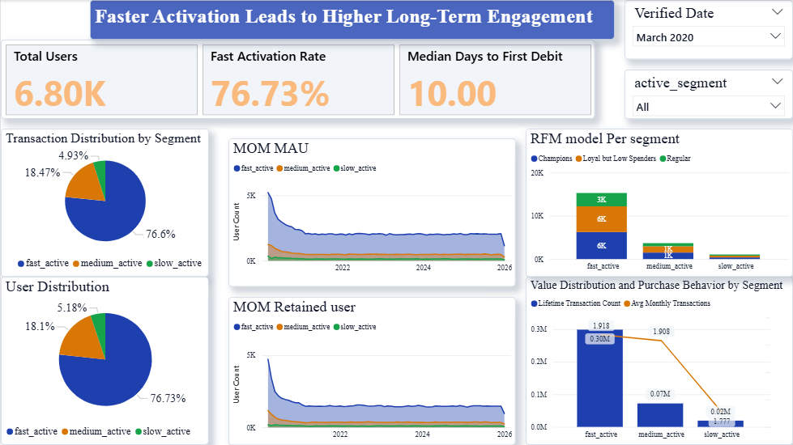
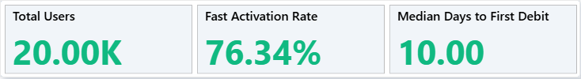
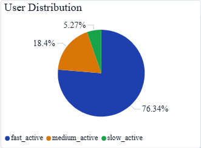
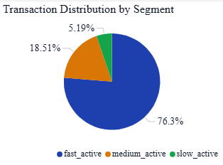
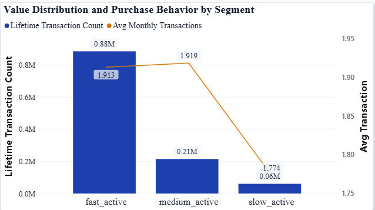
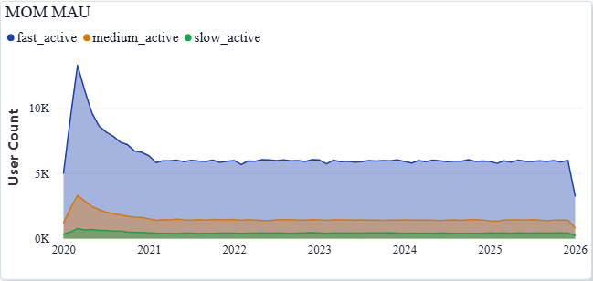
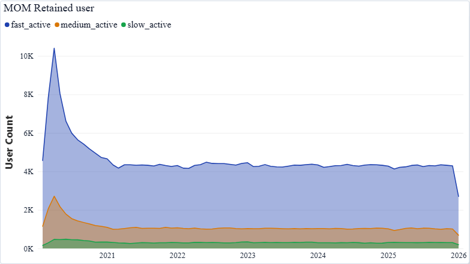
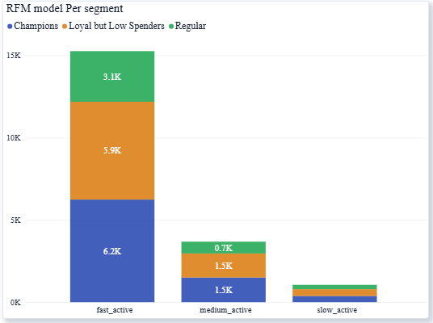

# Executive Summary

This analysis explores the relationship between the rate at which users are activated after account verification and the strength of user engagement over the long term. Using a synthetic data set that mirrors the behavior of actual users within the fintech space, users were grouped by the time it took to make their first debit transaction.

From the findings, it is clear that a strong relationship exists between users who are activated within the first 10 days and the amount of lifetime transactions generated by users, Champion concentration, and the scale of the platform. However, the rate at which users are retained over the long term tends towards 28% for all users.

The analysis highlights a high-intensity "Medium Active" cohort as a key opportunity segment and recommends prioritizing early transaction velocity followed by post-activation transaction diversity to improve retention.

---

# 1. Introduction

In eSewa, the first few days after user verification are critical. This early window often determines whether a user merely signs up or develops a lasting usage habit. This analysis explores whether users who activate quickly after verification demonstrate stronger long-term engagement compared to those who delay their first meaningful transaction.

Activation is defined using the first debit transaction of any type (excluding system-level interpretation such as intent), as debit activity represents deliberate user engagement rather than passive balance loading.

## 1.1 Objective

To evaluate whether the speed of the first transaction after verification is associated with stronger long-term engagement and retention.

---

# 2. Hypothesis Statement

"Users who complete their first transaction within 10 days of verification show higher long-term engagement than users who activate later."

The assumption behind this hypothesis is rooted in behavioral economics: early action reinforces habit formation, reduces drop-off risk, and increases the likelihood of repeated platform usage.

---

# 3. Data Source & Nature

This analysis was conducted on a synthetic (dummy) transaction dataset designed to realistically mirror eSewa's user lifecycle, transaction behavior, and growth patterns from 2020–2026. While the data does not represent real customer activity, the distributions, constraints, and relationships were intentionally structured to reflect plausible fintech usage dynamics.

As a result, the insights should be interpreted as methodological demonstrations rather than exact business outcomes, with primary value in the analytical framework, segmentation logic, and decision-making approach.

---

# 4. Data Cleaning and Preprocessing

## 4.1 Mass Consolidation

Merged multi-year Parquet files (2020–2026) into a single master dataframe, extracting "year-month" metadata from filenames to preserve the chronological source for 1.15M+ transactions.

## 4.2 Dataset Integration

Conducted an inner merge between transaction logs and customer profile data using account_id as the primary key to align verified dates with actual financial activity.

## 4.3 Feature Extraction

Engineered a custom logic to isolate the first debit category for each user by identifying the earliest "debit" type transaction occurring after their initial account entry.

- **Activation Lag Analysis:** Calculate the exact time delta (day_diff) between a user's verification date and their first transaction to quantify the speed of onboarding success.

- **Behavioral Segmentation:** Segmented the entire user base into Fast, Medium, and Slow Active cohorts using day-difference thresholds (0-10, 11-30, and 30+ days) to facilitate targeted engagement analysis.

---

# 5. User Segmentation: Activation Speed

Users were segmented based on the number of days between account verification and their first debit transaction:

- **Fast Active Users:** First debit transaction within ≤ 10 days of verification

- **Medium Active Users:** First debit transaction between 11–30 days

- **Slow Active Users:** First debit transaction after > 30 days

This segmentation allows for a clear comparison of engagement patterns across different activation speeds.

---

# 6. Engagement Metrics Used

To evaluate long-term engagement, the following KPIs were analyzed at the user level:

- **Lifetime Transaction Count:** Total number of debit transactions per user segment

- **Average Monthly Transactions:** Intensity of platform usage

- **Monthly Retention Rate:** Percentage of users remaining active month-over-month

- **Average Active Lifetime (Months):** Duration between first and last observed activity

- **Retention Definition:** A user is considered "active" in a given month if they complete at least one debit transaction during that month. Monthly retention is measured as the percentage of users from the previous month who remain active under this definition.

Together, these metrics provide a holistic view of both usage depth and persistence.

---

# 7. Dashboard Evidence

**Figure 7.1: Dashboard**

With this dashboard, users can compare engagement with the platform based on segments that use activation speed, by measuring Monthly Average Users (MAU), Retention, and Transaction Volume. The platform has a large amount of fast active users contributing significantly to the overall activity and scale of the platform, while Retention trends indicate that all segments are coming together around 28% - demonstrating a common long-term retention baseline.

In terms of Monthly Transaction Intensity, although the Medium Active segment is the smallest of the four cohorts, they have generated the highest volume of transactions per person. Ultimately, this dashboard shows that the early activation phase of a user drives growth; however, to achieve long-term success with engagement, a user must engage repeatedly and diversify their usage.

## 7.1 KPI Cards

**Figure 7.2: KPI of user, fast activation rate and median days of first debit transaction**

**Median Days to First Debit:**

| Segment           | Median Days to First Debit | Business Implication                                                                          |
| ----------------- | -------------------------- | --------------------------------------------------------------------------------------------- |
| **Fast Active**   | **10 Days**                | **Target Benchmark:** Represents the "Gold Standard" for user habit formation                 |
| **Medium Active** | **20 Days**                | **The Transition Zone:** Users are at risk of losing momentum; intervention is critical here. |
| **Slow Active**   | **50 Days**                | **High-Churn Risk:** These users require significantly higher acquisition costs to re-engage. |

**Table 7.1: Median Days to First Debit Table**

The Fast Active segment's 10-day median represents the fastest path to user habit formation—this is the "gold standard" the platform should target. The 20-day mark for Medium Active users represents a transition zone: users who take this long are at elevated risk of losing momentum, requiring immediate intervention. In contrast, Slow Active users, with a 50-day median, are showing high-churn risk and demand significantly more re-engagement investment to reactivate.

**Fast Activation Rate (76.34%):**

This 76.34% metric means that three out of every four users naturally complete their first transaction within 10 days. This level of early adoption is remarkable and reflects strong product-market fit. It suggests that the platform's onboarding experience is already performing at a high baseline. However, the remaining ~23% who fall outside this window represent a substantial retention opportunity.

## 7.2 User Distribution

**Figure 7.3: User Distribution across segments**

This pie chart shows the scale of each segment:

- **Fast Active (76.73%):** 15,267 users – the majority

- **Medium Active (18.47%):** 3,679 users – a smaller but higher-quality segment

- **Slow Active (5.18%):** 1,054 users – high churn risk

The breakdown confirms that the platform's volume is primarily driven by the "Fast Active" majority. However, the meaningful presence of "Medium Active" users signals that nearly 1 in 5 users take longer to engage—but still activate. The small 5.18% in "Slow Active" represents the marginal cohort most likely to churn if they don't receive timely re-engagement interventions.

## 7.3 Transaction Distribution by Segment

**Figure 7.4: Transaction Distribution by Segment**

While Fast Active users dominate in scale (76.6%), Medium Active users contribute a disproportionately high share of transactions relative to their numbers. This signals that **Medium Active users are high-quality users** who, once activated, become heavy transactors. This group deserves a focused re-engagement strategy to maximize their post-activation intensity.

**Transaction Count by Segment:**

| Active Segment | Count of txn_id |
| -------------- | --------------- |
| fast_active    | 884054          |
| medium_active  | 214432          |
| slow_active    | 60130           |

**Table 7.2: Transaction count by segment**

This table provides the raw transaction counts, showing that Fast Active users dominate with 884,054 transactions. However, when examined on a per-user basis, Medium Active users actually show the highest intensity, contributing 214,432 transactions from a much smaller base of 3,679 users. This reinforces their value as a "Refined Explorer" cohort.

## 7.4 Value Distribution and Purchase Behavior by Segment

**Figure 7.5: Value Distribution and Purchase Behavior by Segment**

This dual-axis chart highlights the contrast between volume (blue bars = total lifetime transactions) and intensity (orange line = average monthly transactions). While the Fast Active segment generates massive total volume (0.88M lifetime transactions), **the Medium Active segment shows the highest transaction intensity (1.92 monthly transactions)**, despite being much smaller in size.

This validates the hypothesis that although users who activate slowly take longer to engage initially, they compensate by becoming more frequent transactors once they do. The data shows that the Medium Active segment represents a "late bloomer" cohort with untapped potential. If the platform can shift some of the Slow or Medium Active users toward the Fast Active window through targeted onboarding, it could significantly accelerate platform-wide engagement.

## 7.5 Monthly Active Users (MAU)

**Figure 7.6: Month-over-Month MAU**

**Early Volatility (2020):** This sharp spike at the start of 2020 reflects the platform's early-stage user acquisition phase. Fast Active users rapidly onboard, creating a steep initial ramp. The subsequent decline represents natural attrition as the platform's product-market fit stabilizes.

**Plateau (2021–2026):** The stabilization around 5K Fast Active MAU indicates maturity. The platform's growth has plateaued, but this is a positive sign of healthy retention. The consistent monthly contributions from all three segments suggest a product that maintains a steady user base.

**The Feb-March "Dip & Rebound" Pattern:** This is the most critical insight. The consistent drop in February followed by a March recovery appears across all years. February represents a behavioral pivot point. Our most intense users are at risk of being lost in their second month. However, the March recovery proves that targeted re-engagement can successfully convert 'hesitant' users into 'power users.' The business should treat the March rebound as a blueprint for saving at-risk cohorts.

**Fast Active (The Leader):** Stays at the top of the graph consistently. This group provides the platform's volume and immediate revenue.

**Medium Active (The Quality Group):** Despite the Feb-March fluctuation, they settle into a stable plateau. Their 1.92 average monthly transactions mean that while they are fewer in number than the Fast segment, their individual value is the highest.

**Slow Active (The Marginal Group)**: This segment (yellow/bottom line) shows the shallowest regain. If a user waits 50 days to activate, the data shows they almost never "bounce back" to high activity levels.

## 7.6 Month on Month Retained User

**Figure 7.7: Month on Month User Retention**

The March rebound in retention directly fuels the rise in Monthly Active Users (MAU). While the February dip marks a high-risk "churn zone," the recovery proves that re-engagement effectively stabilizes platform scale. This cycle acts as a blueprint for converting hesitant newcomers into the Power Users that drive eSewa's long-term volume.

**Fast Active:** Hovering around 28-30%.

**Medium Active:** Stabilized at ~28%.

**Slow Active**: Stabilized at ~28%.

**The Volume Driver:** "Fast Active" users represent the bulk of your retained base (e.g., 4,255 users in July 2025).

The business has moved past its early-stage volatility (seen in 2020) and reached a "mature" state. However, the convergence of all segments to the same rate suggests that the product experience is currently impacting all users equally, regardless of their initial intensity.

## 7.7 RFM Model per segment

**Figure 7.8: RFM model for each segment of user**

| **Activity Tier** | **Volume** | **Key Characteristic**                                      | **Analysis**                                                                                            |
| ----------------- | ---------- | ----------------------------------------------------------- | ------------------------------------------------------------------------------------------------------- |
| **Fast Active**   | **15,267** | **High Value Hub:** 41% are Champions.                      | **Scale & Upsell:** The primary revenue driver. Focus on increasing AOV for the 6k Loyalists.           |
| **Medium Active** | **3,679**  | **Retention Risk:** Healthy mix, but 4x smaller volume.     | **Intervene:** High risk of "velocity decay." Use frequency-based triggers to move them back to "Fast." |
| **Slow Active**   | **1,054**  | **Churn Warning:** Highest % of "Regular" (low-tier) users. | **Automate:** Minimal manual effort. Use low-cost re-engagement to filter for seasonal buyers.          |

**Table 7.5: RFM Model per segment**

---

# 8. Key Findings

- **High Initial Adoption:** Approximately 76.34% of users are "Fast Active," meaning they complete their first transaction within 10 days of verification.

- **Transaction Intensity:** While "Fast Active" users drive the highest total volume (over 884,000 lifetime transactions), "Medium Active" users (11–30 days to activate) actually show slightly higher intensity with an average of 1.92 monthly transactions.

- **Segment Distribution:** The user base is composed of 15,267 Fast Active users, 3,679 Medium Active users, and 1,054 Slow Active users.

- **Retention Convergence:** Regardless of how quickly they initially activated, retention for all three segments eventually stabilizes at approximately 28–30%.

- **Champion Concentration:** 41% of "Fast Active" users are categorized as "Champions" in the RFM model, representing the platform's highest-value hub.

---

# 9. Interpretation

- **The "Gold Standard" Window:** The data supports the hypothesis that the first 10 days are critical; users who activate in this window are significantly more likely to become "Champions" and drive platform scale.

- **Late Bloomer Potential:** "Medium Active" users are "Late Bloomers." Although they take longer to start, they demonstrate the highest usage intensity once they do activate, suggesting they are high-quality users who may have faced initial friction.

- **Diminishing Returns for Slow Starters**: Users who take more than 30 days to activate (Slow Active) have a median activation time of 50 days and rarely "bounce back" to high activity levels, indicating a high risk of permanent churn.

---

# 10. Business Implications for eSewa

## 10.1 The 10-Day "Conversion Window"

76% of eSewa's high-value users (Champions) perform their first transaction within 10 days of verification.

**Implication**: The first 10 days are the critical window for habit formation. eSewa must prioritize Transaction Velocity over all else. If a user hasn't moved funds by Day 3, trigger a category-agnostic "First Transaction Bonus" (e.g., cashback on any mobile recharge or P2P transfer) to cross the psychological trust barrier.

## 10.2 Leveraging the "High-Intensity" Medium Segment

Medium Active users (11–30 days) exhibit the highest monthly transaction intensity (1.92).

**Implication:** These are "Refined Explorers" who take time to trust the app but become more active once they do. Instead of aggressive promos, eSewa should focus on Account Linking education for this cohort. Removing fund-load friction during this window maximizes their natural tendency for high-frequency usage.

## 10.3 The 28% Retention Ceiling

Retention plateaus at ~28% regardless of activation speed.

**Implication:** Fast activation drives volume, but Transaction Diversity drives retention. After the initial 10-day sprint, the focus must shift from "any transaction" to "multiple types of transactions." Moving a user from a single use-case to three distinct activities is the only way to break the 28% floor.

---

# 11. Limitations and Future work

## 11.1 Limitations

- The analysis uses synthetic data, so findings reflect methodology and directional patterns rather than real user behavior.

- Results show correlation, not causation, between activation speed and engagement.

- Transaction value, seasonality, and external factors were not explicitly controlled.

## 11.2 Future work

- Validate findings using real production data and controlled A/B experiments.

- Incorporate transaction value and category-level analysis to better assess revenue impact.

- Analyze cohort and seasonality effects to refine retention and activation insights.

---

# Conclusion

The hypothesis that faster activation leads to higher long-term engagement is largely validated, specifically regarding user volume and the likelihood of becoming a high-value "Champion". While "Fast Active" users are the primary engine for revenue and scale, "Medium Active" users represent a high-quality "Transition Zone" where proactive engagement can yield high intensity. To maximize growth, the business should treat the 10-day activation mark as the primary target benchmark while refining the second-month user experience to prevent the observed retention drop-offs.
